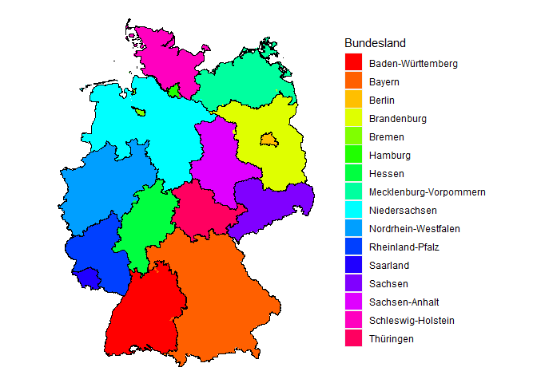

<!-- README.md is generated from README.Rmd. Please edit that file -->

# dePlzMap

<!-- badges: start -->
<!-- badges: end -->


The `dePlzMap` R package is a tool for visualizing data on a map of
Germany, using postal code (PLZ) boundaries as geographic units. It
provides a simple and flexible interface for creating [choropleth
maps](https://en.wikipedia.org/wiki/Choropleth_map) of PLZ regions in
Germany with continuous color scales, allowing users to explore spatial
patterns and relationships in data. The package includes the possibility
to normalize the input values by population per PLZ region to show
population-relative values. The package leverages the `ggplot2` and
`ggmap` libraries for generating the plots. The plots can be created via
the function `dePlzMap` which users can quickly generate informative
maps that highlight patterns in via R.

## Data

The population data is based on the data from the [“Registerzensus
2011”](https://www.zensus2011.de/DE/Home/Aktuelles/DemografischeGrunddaten.html?nn=559100)
of the Statistisches Bundesamt in Deutschland and was obtained from the
web site
[https://www.suche-postleitzahl.org](https://www.suche-postleitzahl.org/downloads).

The shape files that describe the borders of the PLZ regions have also
been drawn from
[https://www.suche-postleitzahl.org](https://www.suche-postleitzahl.org/downloads).

The shape data for the borders of the German states is from
<https://public.opendatasoft.com/>.

## Licensing

The geographic data used by the package is derived from
[OpenStreetMap](https://www.openstreetmap.org/) and is available under
the [Open Database License](https://opendatacommons.org/licenses/odbl/)
(© OpenStreetMap contributors).

The population data is copyrighted by Statistisches Bundesamt (2014),
which allows the distribution of the data, also in parts, if the source
is specified.

Apart from the data, the package is licensed under the MIT license (©
Stefan Lenz 2023).

## Installation

You can install the `dePlzMap` package from
[GitHub](https://github.com/) in R via:

``` r
# install.packages("devtools")
devtools::install_github("stefan-m-lenz/dePlzMap")
```

## Usage

For demonstration purposes load the package together with some example
data included in the package:

``` r
library(dePlzMap)
populationData <- read.table(system.file("extdata", "populationData.csv", package = "dePlzMap"),
                             sep =",", header = TRUE, 
                             colClasses = c("character", "integer", "character"),
                             encoding = "UTF-8")
```

The CSV file contains information about the number of inhabitants for
each of the PLZ regions and the information in which federal state
(Bundesland) the PLZ region is located.

``` r
head(populationData)
#>     plz Population Bundesland
#> 1 01067      11957    Sachsen
#> 2 01069      25491    Sachsen
#> 3 01097      14821    Sachsen
#> 4 01099      28018    Sachsen
#> 5 01108       5876    Sachsen
#> 6 01109      20010    Sachsen
```

This data can now be used to display the population per PLZ region in
Germany:

``` r
dePlzMap(data = populationData[, c("plz", "Population")],
         title = "Bevölkerung in Deutschland 2011", legendTitle = "Einwohner")
```

 For
this purpose, only two columns of the `populationData` data frame was
used.

If only a single state or a specific set of states should be shown, the
argument `bundesland` can be specified:

``` r
dePlzMap(data = populationData[, c("plz", "Population")],
         bundesland = "Rheinland-Pfalz",
         title = "Bevölkerung in Rheinland-Pfalz", legendTitle = "Einwohner")
```


It is also possible to color the regions according to categorical
values. In the next example, the PLZ regions are colored according to
the state they are associated with. If you look closely, you you can see
here that there are a few PLZ regions that go across federal state
boundaries, e.g., in Hamburg or Brandenburg.

``` r
dePlzMap(data = populationData[, c("plz", "Bundesland")])
```



As the resulting object is a `gpplot` object, the appearance can be
manipulated further via the `+` operation. There are also several
options for further customizing the plot via arguments of the `dePlzMap`
function.
